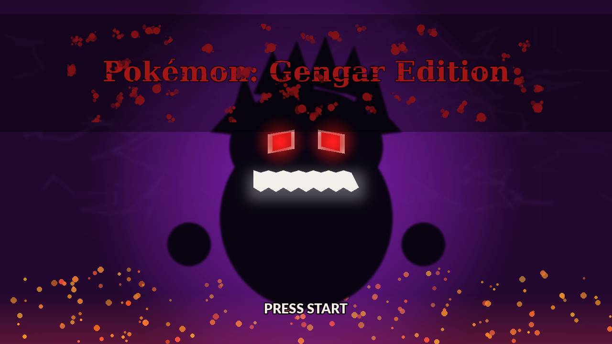
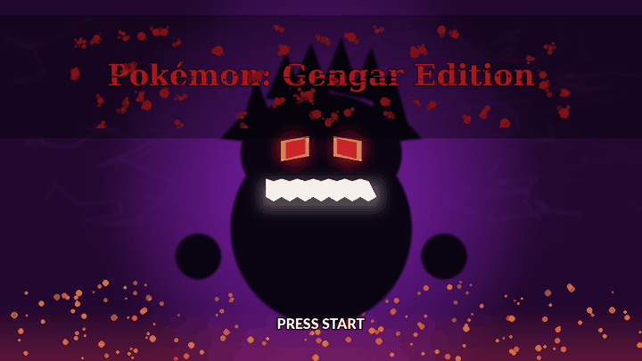

# Pokémon Emerald — Gengar Edition (Gastly Starter Hack)



A weekend ROM hack for Pokémon Emerald (US 1.0). Built mostly with Claude — I drove the design choices, ran the emulator, debugged the live issues, and Claude did the byte-level ROM work. Posting it because I had fun and figured someone else might too.

## What it does

- **Gastly is one of the three starters** in Birch's satchel (left Pokéball)
- **Haunter evolves into Gengar at level 36** by leveling up — no more trade-evolution dead end
- **The Gastly line gets a 36-move natural learnset** spanning level 1 to 99. Hypnosis, Bite, Sludge Bomb, Shadow Ball, Psychic, Dream Eater, all three elemental punches, Destiny Bond, Perish Song, Explosion — basically every move Gengar has ever known, learned naturally as you level
- **All TMs and HMs work on the Gastly line**, including HMs that are normally type-locked
- **HMs can be forgotten** at the move screen — no Lilycove Move Deleter required
- **The other three starters are catchable in the wild** at ~10% rate on themed routes (Mudkip on Route 102, Torchic in Fiery Path, Treecko on Route 119)
- **Mew (Route 120), Celebi (Petalburg Woods), and Deoxys (Route 121)** are catchable at 1% rate
- **Every Pokémon's catch rate is set to engine max (255)** — virtually any wild encounter catches with a regular Poké Ball when weakened
- **Gengar's base stats are boosted to pseudo-legendary tier** (100/110/95/130/150/110 = 695 BST)
- **Starting money is bumped to $999,999** (the game cap) — effectively unlimited
- **Gastly knows Bite at level 1** so it can actually damage Zigzagoon (the original Gen-1 design is broken for a starter; Ghost moves don't hit Normal types)

## Animated title mockup

The title screen graphics live elsewhere in the ROM and would need real tile-art conversion to put in-game. This is the reference mockup I'd hand to anyone doing that work:



Pulsing eyes, breathing purple aura, blinking "PRESS START" — generated procedurally with PIL.

## What's in this repo

| File | What it is |
|------|------------|
| `patch/gastly_starter.ips` | The IPS patch (2.7 KB). Apply to a clean Emerald US 1.0 ROM. |
| `tools/gengar_save_editor.py` | Native Python save editor — sets a Pokémon's nature and held item. Works on macOS/Linux, no .NET, no Wine, no PKHEX. |
| `docs/hack_guide.md` | The technical write-up — every byte offset, every patch, every workaround. Useful if you want to extend or modify. |
| `images/` | The title screen mockup, animated preview, and the four font options I considered. |

**Not included:** the patched ROM itself. You need to apply the IPS to your own legal copy of Pokémon Emerald. That's the convention for ROM hacks and the only legally clean way to distribute these.

## How to use

### 1. Apply the patch

You need a clean Pokémon Emerald (US 1.0) ROM. CRC32 should be `1F1C08FB`.

Get [Lunar IPS](https://www.romhacking.net/utilities/240/) (Windows/Wine), [Floating IPS](https://www.romhacking.net/utilities/1040/) (cross-platform), or any IPS patcher. Apply `patch/gastly_starter.ips` to your ROM. Output is a new patched ROM.

Verify it worked: CRC32 of the patched ROM should be `40F506BB`.

### 2. Play it

Load the patched ROM in mGBA, VBA, or any GBA emulator. Start a new save (existing vanilla saves work but won't get the starter swap). Pick the left Pokéball when Birch shows up. Gastly is yours.

### 3. (Optional) Edit your save

Want Gastly to have a specific nature or hold a specific item? The Python script handles that:

```bash
python3 tools/gengar_save_editor.py path/to/your_save.sav
```

Currently hardcoded to set the slot-0 Pokémon to Timid nature + Leftovers. Edit the script's `NATURE_TIMID` and `ITEM_LEFTOVERS` constants to change. Backs up the original to `.sav.bak`.

## Caveats

- **Pokémon Emerald US 1.0 only.** Other ROM versions (1.1, EU, Japanese) will have different byte offsets and the patch won't apply cleanly.
- **The title screen mockup is not in the ROM.** Replacing the actual title screen requires LZ77 decompression, tile-art conversion, and palette work that needs proper ROM hacking tools (TilemapStudio, etc.). The mockup is reference art for anyone who wants to do that work.
- **Four nice-to-haves are not patched in:** Run Indoors, Faster Default Text Speed, 100% Catch Rate with Any Ball, and Truly Unlimited Balls. All are available as community IPS patches you can apply on top of this one. Details in `docs/hack_guide.md`.
- **Distributing the patched ROM is not OK.** Nintendo owns Pokémon Emerald's code. The IPS patch in this repo only contains *changes* — no Nintendo code — which is the legally accepted form for ROM hack distribution.

## Credits

- Patches and tools designed/written collaboratively with [Claude](https://claude.ai) (Anthropic), May 2026
- Built on top of the excellent [pokeemerald](https://github.com/pret/pokeemerald) decompilation reference from the pret community
- Original Pokémon Emerald: Game Freak / Nintendo / The Pokémon Company

## License

The patch file, save editor script, mockup images, and documentation in this repo are released under the MIT License (see `LICENSE`). This does **not** grant rights to any underlying Pokémon Emerald code — those rights belong to Nintendo.
